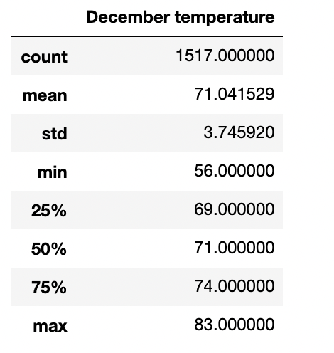

# Surfs_up

**ANALYSIS OVERVIEW**

The purpose of this analysis is to analize the temperature statistics from the months of June and December in Oahu to determine if opening the Surf Shop will be ideal. This process involves running queries for both months to obtain the temperature data, then we store the tempetaures in a list, convert them into a dataframe and lastly get the summary statistics using the describe() method.

**RESULTS**

-> June Temperature summary statistics show that from a total count of 1700  the mean is 74.9, min is 64.0 and max is 85.0

-> December Temperature summary statistics show that from a total count of 1517 the mean is 71.0, min is 53 and max is 83.0

-> Standard deviation is 3.25 in June and 3.75 in December. The difference between these standard deviations is 0.50

**SUMMARY**

The temperature results from June and December are somewhat close to each other depite June having a higher sample size compared to December.The sample size may be a factor as to why we observe higher summary statistics in June compared to December.The min temperature difference between the two months is approximately 4 and the max temperature difference is 2 indicating that the temperature difference in these months doesn't vary much. Also, the standard deviation for both months is small(approximately 3) meaning that the results are close to the mean.

Another query we should consider running would be a Precipitation query for June and December. The results would help us determine with month has more rain.
Also, a weather station query would help identify temperature differences in multiple locations. In our case this would help us decide if Oahu is the best or worst location to open up the surf shop becasue these queries will be able to predict if this location would draw more people in order for the store to be successful.

